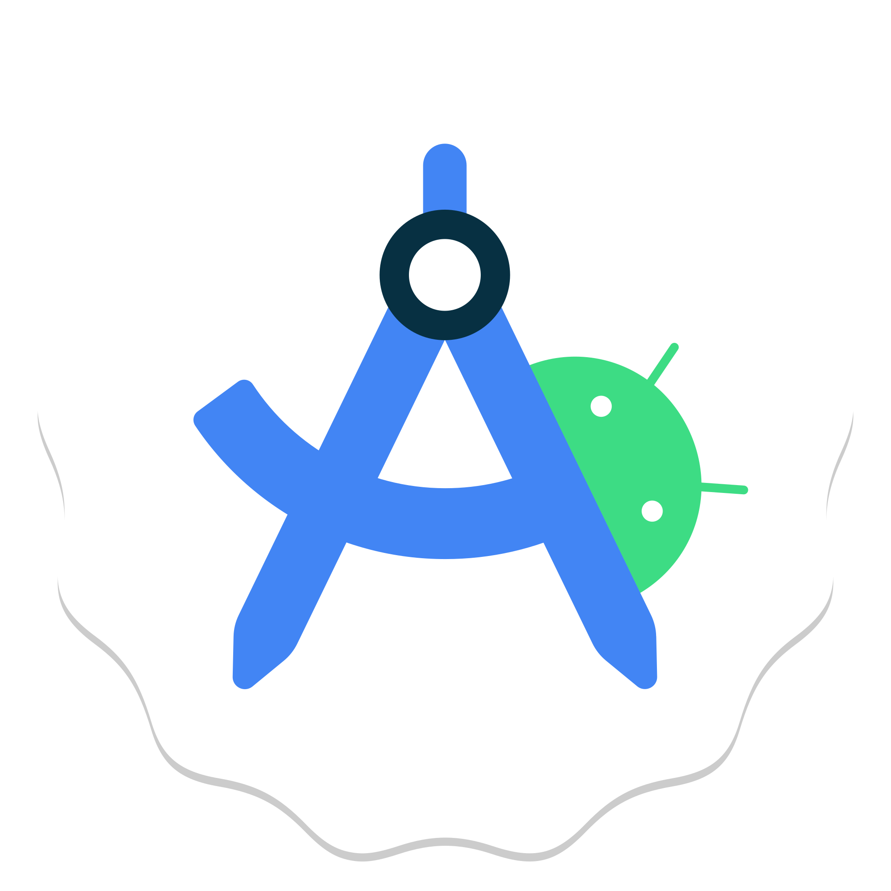

### Hi there 👋

<a href="https://github.com/cuevas69" class="btn btn-sm btn-outline-secondary">Follow</a>

[MI CV](Andres_Cuevas_Rodriguez_CV.pdf)

<h2>SKILLS:</h2>
    <table>
        <tr>
            <td>HTML</td>
            <td></td>
        </tr>
        <tr>
            <td>CSS</td>
            <td></td>
        </tr>
        <tr>
            <td>Java</td>
            <td></td>
        </tr>
        <tr>
            <td>JavaScript</td>
            <td></td>
        </tr>
        <tr>
            <td>C#</td>
            <td></td>
        </tr>
        <tr>
            <td>Angular</td>
            <td></td>
        </tr>
        <tr>
            <td>API-Rest</td>
            <td></td>
        </tr>
        <tr>
            <td>Visual Studio</td>
            <td></td>
        </tr>
        <tr>
            <td>Android Studio</td>
            <td></td>
        </tr>
    </table>
    
<h2>CONTACTO:</h2>

<strong>andrescuevas507@gmail.com</strong>

